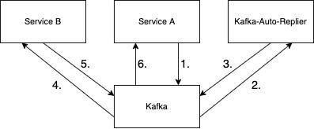

# Kafka Auto-Replier

## Basic Concept

This application automatically creates kafka events for incoming events. The idea was to create an application like
wiremock for kafka event processing, so you could easily define which message should produce a new message. You only
need to create stub JSON config which contains a consumer definition and a producer definition. The consumer-config
describes which Event should be listend to and if one was created the producer-config defines where to forward
a newly created message.

### Example


1. Service A initiates a Kafka Event
2. The Auto-Replier consumes the Event from Service A
3. Based on the defined config the Auto-Replier creates an Event to the defined topic
4. Service B consumes the auto-replied message
5. Service B processes further and creates its own Event
6. Service A consumes the Event from Service B and didn't notice that other system were mocked

## Properties

### Consumer Json Properties

|Key   |Description   | required |
|----------|-------------|------|
| topic |Defines the Kafka Topic to listen to, if it gets a message it will produce an event according to the corresponding producer-config  | true |
| jsonPathFilter | If this property is defined it will interpret the value as JsonPath String. If the JsonPath expression matches to the incoming event, it will produce an event according to the corresponding producer-config. If the incoming event won't match the expression it will not create a new event     |   false |

### Producer Properties

|Key   |Description   | required |
|----------|-------------|------|
| topic |Defines the Kafka topic name which is used to forward a message to  | true |
| data |This field is used to directly define the message body that is getting forwarded| exact one of `data`,`replyFile`or`replyTemplate` should be defined |
| replyFile |Is used to reference reply file to send to the defined topic. If you want to reference files checkout the [Reference files](##Reference files) section |exact one of `data`,`replyFile`or`replyTemplate` should be defined |
| replyTemplate |Is used to reference a template reply file. The template replacement get done by using the [handlebars](https://github.com/jknack/handlebars.java) library  |exact one of `data`,`replyFile`or`replyTemplate` should be defined |

## Examples

### Inline definition

```json
{
  "stubs": [
    {
      "consumer": {
        "topic": "input"
      },
      "producer": {
        "topic": "output",
        "data": "{\"some\":\"message\"}"
      }
    }
  ]
}
```

The JSON-Config above will tell the application that if any message was sent to the topic `input`, it will create a
message with the payload `{"some":"message"}` and will send it to the topic `output`

### Reply Files

```json
{
  "stubs": [
    {
      "consumer": {
        "topic": "input"
      },
      "producer": {
        "topic": "output",
        "replyFile": "reply.json"
      }
    }
  ]
}
```

The JSON-Config above will tell the application that if any message was sent to the topic `input`, it will create a
message that will contain the payload from the file `reply.json` and will send it to the topic `output`. If you want to
use `replyFile`
you should ensure that its in the classpath in the `replies/` Folder, or you can override the
property `reply-file-folder: "replies"` with the folder that contains your defined reply file

### Json Path Filter

```json
{
  "stubs": [
    {
      "consumer": {
        "jsonPathFilter": "$[?(@.test=='data')]",
        "topic": "input"
      },
      "producer": {
        "topic": "output",
        "data": "{\"some\":\"message\"}"
      }
    }
  ]
}
```

This Json-Path-Filter-Config tells the application that only if consumer message on the topic `input` that matches the
given filter `jsonPathFilter: "$[?(@.test=='data')]"` will create a reply to the topic `output`. In this particular case
the field `test` must have the value `data` to create consumer message. For further readings about JsonPath check this
link: https://github.com/json-path/JsonPath

### Multiple Messages on same Topics

```json
{
  "stubs": [
    {
      "consumer": {
        "topic": "input"
      },
      "producer": {
        "topic": "output",
        "data": "{\"message\":\"hello\"}"
      }
    },
    {
      "consumer": {
        "topic": "input"
      },
      "producer": {
        "topic": "output",
        "data": "{\"message\":\"word\"}"
      }
    }
  ]
}
```

As you see above you could also define multiple reply messages for only one incoming message.

### Reference files

```json
{
  "stubs": [
    {
      "consumer": {
        "topic": "input"
      },
      "producer": {
        "topic": "output",
        "replyFile": "reply.json"
      }
    }
  ]
}
```

You could also reference files that contains a larger message to reply. To configure it you need to set the application
property `reply-file-folder` to the parent directory of you reply-file, you could also override the property using
springs relaxed binding via environment variabel `REPLY_FILE_FOLDER`. An example can be
seen [here](src/test/java/com/kafka/replier/FileReplyIT.java)

### Reply Template files

#### Stub Config

```json
{
  "stubs": [
    {
      "consumer": {
        "topic": "test"
      },
      "producer": {
        "topic": "new",
        "replyTemplate": "reply-template.json"
      }
    }
  ]
}
```

#### reply-template.json

```text
{
  "id": "{{id}}",
  "auto": {
    "farbe": "grün",
    "marke": "{{peter.lustig.name}}"
  },
  "example": "example"
}
```

You could also reference templates ,this gives you the ability to create dynamically messages based on the incoming
message. In this particular example, the field `id` of the incoming message is going to get replaced using `{{id}}`. You
can also reference complexer structure like `{{peter.lustig.name}}`. Below you can see the incoming message and the
resulting outgoing message.

#### incoming Messsage

```json
{
  "id": "123456",
  "peter": {
    "lustig": {
      "name": "hallo"
    }
  }
}
```

#### outgoing message Messsage

```json
{
  "id": "123456",
  "auto": {
    "farbe": "grün",
    "marke": "hallo"
  },
  "example": "example"
}
```